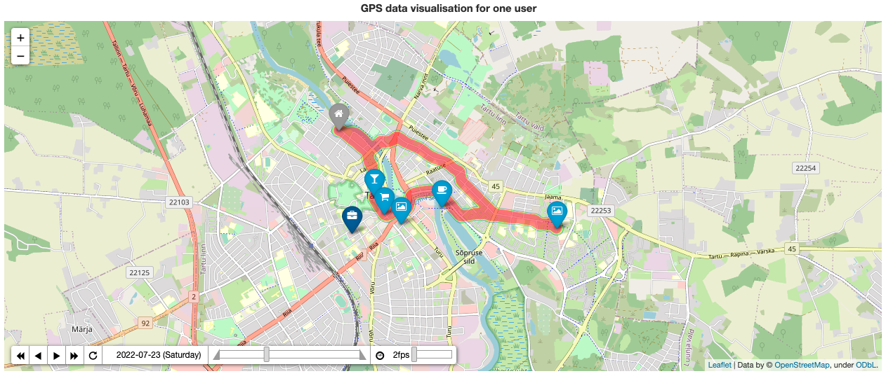

# GPS_GENERATOR

## Overview :fax:

This Python codebase generates **synthetic GPS data** based on configurable properties of a network (e.g., a place of interest) and users (e.g., speed limit).

For more detailed documentation please refer to - https://NikolayKozlovskiy.github.io/GPS_GENERATOR/