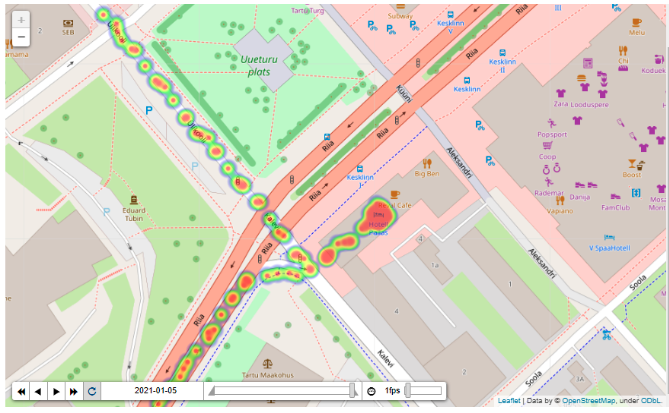

# GPS_GENERATOR



## Overview :fax:

This Python codebase generates **synthetic GPS data based on the properties of a network and users**. The code source allows for flexible specification of unique characteristics for a network (e.g., a place of interest) and user parameters (e.g., speed limit).

The basic foundation of the approach is as follows:

- Each use case is denoted as a **profile**. For each profile, network and user parameters should be specified
- Profiles **can share the identical network** (if network parameters are the same), but will always have **a different movement history for their users** (meaning that even if users' parameters are the same, the output trajectories will be different)
- A network is a **combination of anchor points/locations and roads/ways that connect locations to each other** (essentially, a graph with nodes and edges)
- All locations are derived from [OpenStreetMap's conceptual data model](https://wiki.openstreetmap.org/wiki/Main_Page) of the physical world using the osmnx library
- There are three main types of locations: **home, work and event** (bars, parks, museums, etc.). Event could be either one of the **regular** locations of a user or **random** location (amenity) in the area
- The entire movement history of a user can be described as **a consecutive process of stay and movement activities happen in some locations**
- The combination of these two types of activities and the type of locations in which they occur are **specified by the plot**. Each unique movement plot should automatically produce a new child class of the Parent Class User (e.g., in this script, it is the User_employed_walk class)

## Deployment :construction_worker:

### Docker + Poetry + Makefile

The concept involves leveraging [Poetry](https://python-poetry.org/docs/#installing-with-the-official-installer), a tool that offers an intelligent and intuitive approach to handle Python dependencies. Poetry doesn't include Python internally, hence it utilizes Python from a Docker image. Code is executed within a docker container, however, the outcome can also be directed to your host. The commands are wrapped up in Makefile for convenience\*

1. Navigate to a directory you want to run the codebase and store results
2. Clone the repo: `git clone https://github.com/NikolayKozlovskiy/GPS_GENERATOR.git`
3. Build a docker image called gps_generator: `make build_docker_image`
4. Based on the image create a docker container named the same, which will constatntly run till it is removed, make sure you specified the correct paths for your source directories in [bind mounts](https://docs.docker.com/storage/bind-mounts/): `make create_docker_container OUTPUT_DIR=/path/to/output`
5. Open new terminal and run the main.py script with CONFIG variable which is a relative path to a config file you want to use: `make run_main_script`. If you want to run some other commands use [docker exec](https://docs.docker.com/engine/reference/commandline/exec/) option, make sure your container is running
6. When you no longer need a container, remove it: `make remove_docker_container`\<br />

Prerequirements:

1. Installed [Docker](https://www.docker.com/get-started/)

\*If make is not available just open Makefile in text editor and run corresponding shell commands in terminal manually

### Conda + Poetry

The fundamental approach remains unchanged, except that in this scenario, Conda is employed to establish an environment with a specified Python version. Despite this, Poetry retains its responsibility for managing dependencies. What approach to use is a difficulty of having alternatives

1. Navigate to a directory you want to run the codebase and store results
2. Clone the repo: `git clone https://github.com/NikolayKozlovskiy/GPS_GENERATOR.git`
3. Move to GPS_GENERATOR directory: `cd GPS_GENERATOR`
4. Create python environment with [conda](https://docs.conda.io/en/latest/), conda is used for downloading python; 3.9 <= python version <= 3.12 because of dependecies' specifics: `conda create --name [your_env_name] python=3.10 -y`
5. Activate python environment: `conda activate [your_env_name]`
6. Install poetry, version - up to you to choose: `pip install poetry==1.6.0`
7. Install other dependencies listed in pyproject.toml, `poetry install --with vis`, **_--with vis_** option specifies that along with core dependencies an optional group called _vis_ should be installed. _Vis_ group includes libraries that you may need to analyse and visualise the output results, run just `poetry install` if you don't need these modules
8. Run the codebase: `python gps_synth/main.py configs/[your_config].yaml`\*<br />

Prerequirements:

1. Installed conda, the easiest way is to download [Miniconda](https://docs.conda.io/projects/miniconda/en/latest/)
2. Installed [gdal](https://gdal.org/) locally

\*You may need to directly specify the python path to GPS_GENERATOR: `export PYTHONPATH=/path/to/GPS_GENERATOR folder` for MacOs, for other operating systems ask [ChatGPT](https://chat.openai.com/) :green_heart:

## Output structure :hut:

There are three main outputs of the repository, all in parquet format and partitioned: 1. GPS data with following columns: `user_id,timestamp,lon,lat,profile_name`; 2. Network data with following columns: `element_type,osmid,name,centre_x,centre_y,loc_type,network_name` 3. Metadata with the following columns: `user_id,home_id,work_id,regular_loc_array,profile_name, network_name`

Example of the output structure:

```
/output_root
├── gps_data
│   │
│   ├── profile_name=profile_name_1
│   │   ├── part-[hex].parquet
│   │   └── part-[hex].parquet
│   │
│   └── profile_name=profile_name_2
│       ├── part-[hex].parquet
│       └── part-[hex].parquet
│
├── metadata
│   │
│   ├── profile_name=profile_name_1
│   │   ├── part-[hex].parquet
│   │   └── part-[hex].parquet
│   │
│   └── profile_name=profile_name_2
│       ├── part-[hex].parquet
│       └── part-[hex].parquet
│
└── network_data
    │
    └── network_name=network_name_1
        ├── part-[hex].parquet
        └── part-[hex].parquet
```

## How to contribute :pill:

I am arrogant enough to think that this project might be interesting for someone. Below is a list of issues which can make the results more humanlike, diverse, and effecient.

1. Make movements more realistic:

- The path between the location and its nearest node can intersect buildings or water bodies (lakes). A user goes through them, it is not realistic
- No gps like errors in the data (e.g. sudden termination of ‘acquiring’ data, or some points that do not make sense)

2. Create more profiles and thus new User classes:

- new locations
- new OSM tags for anchoir points
- new modes of transport and even their combination
- new plots

3. In terms of growing number of profiles possible rethinking of orchestration approach
4. Load testing (but this is in a different life)

##  Aknowledgements

The concept and initial development of this project began during my internship at [Positium](https://positium.com/). For more details on the project's origins, please see the `archive` folder, which includes a PDF documentation (useful for understanding the overall logic) and a Jupyter notebook (not for execution). The evolution of the `GPS_GENERATOR` was also influenced by my experience at Positium, where I had the opportunity to explore various development practices.
