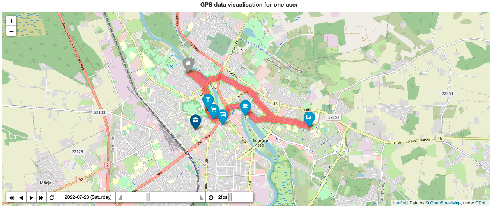

# Welcome to GPS Synth Generator 👣

The project aimed to create a Python codebase for synthetic GPS data generation and also on practice implement some good coding approaches. I would welcome any feedback, contribution, and usage of this code. To better and quicklier grasp the content and the essence of the code I have created GitHub Pages with all relavent information, here is the following sections: 

* **Overview** - a description of the core idea of the project and code orchestration
* **Dev Guide** - a guidelence for setting up a development environment (production is yet not really relevant for this current state of the project) and contribution block with the rules and possible topics to work on
* **User Manual** - a brief explanation of `Makefile` commands to use once a dev env is ready + output structure of the code results
* **Code Reference** - a code documentation
* **Aknowledgement** - to melt your hearts
* **LICENSE** - let's pretend that it will one day be needed

